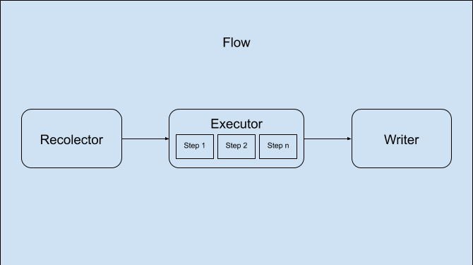

# Python Flow

## Overview
The objetive of this "*Framework*"/methodology is to standarize the application development in a medium/big organization. It is inspired in the Functional paradigm.

## Classes and composition

* **Flow**: The base object, every functionality should be encapsulated in a Flow subclass, all the orquestation between all the other classes will start with the call to `Flow.execute()`.
* **Recolector**: Gathers all the information related to the flow.
* **DataView**: It is the result of the recolector and will contain all the data used in the Flow process will be responsible of the sharing of information between all the components.
* **Executor**: Do whatever processing is needed with the data gathered by the Recolector. It is composed of a series of Steps. They should be declarative in an executor you can only declare a list of Steps (they will be executed one after the other) or a set of Steps (the execution order is not important).
* **Step**: The do the work for Executor. Ideally they should receive data and transform it, in the simpler cases there will be no DB access nor any other external data access. In complex cases they should encapsulate a Flow. It could be possible to include any side effect derived of the transformation done in the Step, those will be executed by the Writer.
* **Writer**: This class will save anything that is needed in the database and any other outside effect needed, including those declared in the Steps contained on the Executor.

## Drawbacks
* This is a really strict process and it could be difficult to follow the rules for this methodology, making the development of new functionalities a bit slow at first, but the benefits of the correct application of it will compensate for that.
* The necessity of gathering all the data in the first step will make the development of Flows more memory hungry than the same functionality developed using other approaches.

## Advantages
* We could create a lot of functionality to the base clases, including logging, automatic monitoring, locking...
* This could really decouple business logic from "*Systems*" logic. This methodology favors a descriptive approach to the development of functionality, this will allow to fine tune the execution without modifying the business logic.
* Given the nature of the Step classes, they could be implemented as lambdas, independent celery process, python processes, etc.
* This methodology is agnostic could work with Django, Flask, Tornado...
* Automatic documentation and tests, it could generate diagrams and complex docs with the functionality of the Flows.
* All the DB access is encapsulated in **Recolectors** and **Writers** making it easier to change the data layer.
* The uniformity of code will make it really easy for anyone to familiarize thenselves with any new code.
